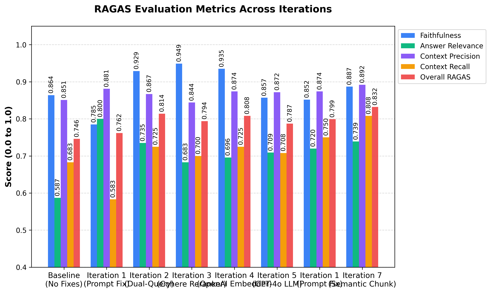

<div align="center">

[](https://www.python.org/)
[](https://fastapi.tiangolo.com/)
[](https://react.dev/)
[](https://www.trychroma.com/)
[](./EVALUATION.md)

**A production-grade, full-stack AI tutor that answers questions grounded strictly in course lecture materials.**

[Read the Full Evaluation Report](./EVALUATION.md)

</div>

---

## What Is This?

Students waste hours manually searching through hundreds of PDF lecture slides to find one definition. This project solves it.

Ask a question in natural language — the system finds the exact lecture slides that answer it and generates a precise, cited answer, streamed word-by-word in real time.

Built for the **Operating Systems & System Administration** university module, but designed to be adapted to any academic domain.

---

## Key Features

### Advanced RAG Pipeline (No LangChain — Built from Scratch)

| Stage | Description |
|---|---|
| **Query Routing** | LLM classifies each input: `SEARCH`, `REFINE`, `CHAT`, or `OUT_OF_SCOPE` |
| **Query Rewriting** | Informal or vague queries are rewritten into precise academic search terms |
| **Dual Sub-Query** | Broad queries are split into two targeted sub-queries to maximise recall |
| **Dense Retrieval** | Both queries hit ChromaDB using `text-embedding-3-large`; results are merged and deduplicated |
| **Cross-Encoder Reranking** | `ms-marco-MiniLM-L-6-v2` re-scores every retrieved chunk against the original query |
| **Adaptive top-k** | Ambiguous queries automatically increase the retrieval window from 6 to 8 chunks |
| **Grounded Generation** | Llama 3.1 8B via Groq generates a cited, markdown-formatted answer streamed token-by-token |

### Semantic Document Chunking

Instead of slicing text at a fixed word count, the ingestion pipeline uses regex-based semantic chunking — splitting by paragraphs and sentences, grouping up to 800 characters to keep concepts intact. This single change pushed Context Recall from 0.725 to 0.808.

### Domain Safety

A dedicated `OUT_OF_SCOPE` routing decision catches any question unrelated to OS/SA and returns a polite refusal without calling the LLM or the vector database.

### Real-Time Streaming UI

Built with React and Vite, communicating over Server-Sent Events (SSE) with the FastAPI backend. Answers stream token-by-token with collapsible source citations showing exact filename, page number, and relevance score.

---

## Evaluation

This project went through 10 structured evaluation phases using the [RAGAS framework](https://docs.ragas.io) to measure Faithfulness, Answer Relevance, Context Precision, and Context Recall across multiple model and technique combinations.

<div align="center">

</div>

### Final Scores — Iteration 7 (Semantic Chunking)

| Metric | Score |
|---|---|
| Faithfulness | 0.887 |
| Context Precision | 0.892 |
| Context Recall | 0.808 |
| Answer Relevance | 0.739 |
| **Overall RAGAS** | **0.832** |

### Key Findings

**The Reasoning Paradox**
GPT-4o (Faithfulness: 0.857) was outperformed by Llama 3.1 8B (Faithfulness: 0.935) in closed-book academic RAG. Frontier models answer from their own training data rather than the provided context. Smaller, instruction-following models are more faithful to the source material.

**Domain-Specific Models Outperform General-Purpose Ones**
Cohere Rerank v3 (Overall: 0.794) underperformed the local `ms-marco-MiniLM` model (Overall: 0.814) on this academic Q&A dataset. The MS MARCO model's question-answering-specific training made it more aligned to student queries than a general-purpose enterprise reranker.

**Semantic Chunking is Non-Negotiable**
Switching from fixed 150-word chunking to semantic chunking pushed the Overall RAGAS score from 0.808 to 0.832, Context Recall from 0.725 to 0.808, and Context Precision to an all-time high of 0.892.

**Dual Sub-Query is the Largest Single Gain**
Adding dual sub-query retrieval for ambiguous questions produced the largest single-iteration improvement: +0.052 Overall RAGAS, Faithfulness +0.144, Context Recall +0.142.

[Read the full 10-phase evaluation report](./EVALUATION.md)

---

## Architecture

```
FRONTEND  React + Vite (localhost:5173)
  Chat UI  ->  api.js  ->  SSE Stream
                |
                | POST /chat
                |
BACKEND  FastAPI (localhost:8000)
  server.py -> search_pipeline() -> stream_grounded_answer()
                |
         retrieval.py
    1. rewrite_query()   ->  SEARCH / REFINE / CHAT / OUT_OF_SCOPE
    2. retrieve_chunks()     x2 sub-queries
    3. merge_and_deduplicate()
    4. rerank_chunks()       Cross-Encoder
                |
         ChromaDB (vector_db/)
         text-embedding-3-large · semantic chunks · 800 chars
```

---

## Project Structure

```
RAG_Project/
├── src/
│   ├── server.py          # FastAPI app — SSE streaming endpoint
│   ├── retrieval.py       # Core RAG pipeline: routing, retrieval, reranking
│   └── ingest.py          # PDF parsing, semantic chunking, ChromaDB ingestion
├── frontend/
│   ├── src/
│   │   ├── App.jsx        # React chat UI
│   │   ├── api.js         # SSE streaming client
│   │   ├── App.css        # Component styles
│   │   └── index.css      # Global theme
│   └── package.json
├── Evaluation/
│   └── ragas_runner.py    # RAGAS evaluation script
├── data/
│   └── knowledge_base/
│       └── operating_systems/
│           ├── lectures/
│           ├── tutorials/
│           ├── labs/
│           └── past_papers/
├── vector_db/             # Auto-generated ChromaDB store
├── EVALUATION.md          # Full 10-phase evaluation report
├── requirements.txt
└── .env                   # API keys (not tracked)
```

---

## Quick Start

### Prerequisites
- Python 3.11+
- Node.js 18+
- OpenAI API key (for embeddings)
- Groq API key — free at [console.groq.com](https://console.groq.com)

### 1. Clone and Install

```bash
git clone https://github.com/lisara-lithman/academic-rag-knowledge-assistant.git
cd academic-rag-knowledge-assistant

# Backend
python -m venv .venv
source .venv/bin/activate        # Windows: .venv\Scripts\activate
pip install -r requirements.txt

# Frontend
cd frontend && npm install
```

### 2. Configure API Keys

Create a `.env` file in the project root:

```env
OPENAI_API_KEY=your_openai_api_key_here
GROQ_API_KEY=your_groq_api_key_here
```

### 3. Add Course Materials

Place PDF lecture slides in:

```
data/knowledge_base/operating_systems/lectures/
data/knowledge_base/operating_systems/tutorials/
data/knowledge_base/operating_systems/past_papers/
```

### 4. Build the Vector Database

```bash
python src/ingest.py
```

First run downloads the reranker model and generates OpenAI embeddings for all PDFs.

### 5. Run

**Terminal 1 — Backend:**
```bash
python src/server.py
```

**Terminal 2 — Frontend:**
```bash
cd frontend && npm run dev
```

Open `http://localhost:5173`.

---

## Tech Stack

| Layer | Technology | Reason |
|---|---|---|
| Embeddings | OpenAI `text-embedding-3-large` | Highest Context Precision in experiments |
| Vector DB | ChromaDB (local, persistent) | Zero-friction local deployment |
| Reranker | `ms-marco-MiniLM-L-6-v2` | Q&A-tuned; outperformed Cohere Rerank v3 |
| LLM | Llama 3.1 8B via Groq | Outperformed GPT-4o on Faithfulness (0.935 vs 0.857) |
| Backend | FastAPI + SSE | Real-time streaming, async-ready |
| Frontend | React 19 + Vite | Component-based, fast hot-reload |
| Evaluation | RAGAS framework | Industry-standard RAG metrics |

---

## License

Built for educational use 

