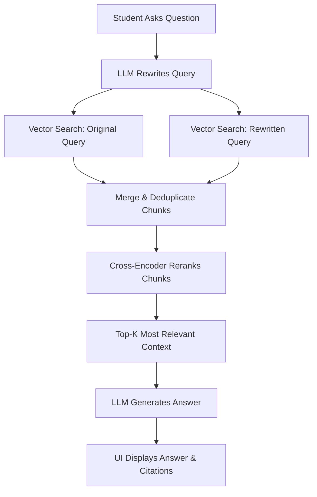

# 🎓 Academic RAG Knowledge Assistant (OSSA)

An advanced, interactive Artificial Intelligence Tutor built to assist university students with the **Operating Systems & System Administration (OSSA)** module. 

Traditional studying often requires manually searching through hundreds of PDF lecture slides, tutorial sheets, and past papers to find specific definitions or concepts. This project solves that problem by using **Retrieval-Augmented Generation (RAG)**. When a student asks a question, the system searches the actual course materials, extracts the most relevant slides, and generates a precise, hallucination-free answer—complete with exact file and page citations.

---

## 🌟 Key Features

- **Automated Knowledge Base Ingestion:** 
  Parses raw PDF lecture slides, tutorials, and past papers. It intelligently chunks the text by page, generates vector embeddings, and stores them in a local, fast vector database.
- **Context-Aware Query Rewriting:** 
  When you ask a follow-up question (e.g., *"What are the advantages of that?"*), the system uses a Large Language Model (LLM) to read the conversation history, figure out what "that" refers to, and rewrites the query into optimized search keywords.
- **Two-Stage Retrieval Pipeline:**
  - **Stage 1 (Dense Retrieval):** Uses `all-MiniLM-L6-v2` embeddings to quickly retrieve the top 5 most relevant slide chunks from the database.
  - **Stage 2 (Cross-Encoder Reranking):** Uses a heavier `ms-marco-MiniLM-L-6-v2` model to meticulously score and re-order those 5 chunks, ensuring only the most highly relevant context is fed to the AI.
- **Dual LLM Provider Support:** 
  Switch seamlessly between:
  - **Groq (`llama-3.1-8b-instant`):** Blazing fast inference speeds.
  - **Google Gemini (`gemini-2.5-flash`):** High context capability and reasoning.
- **Citation-Driven User Interface:** 
  A custom-designed Gradio web UI that features a split-screen design. The left side handles the chat, while the right side dynamically displays the source materials, relevance scores, and page numbers used to answer the current question.

---

## 🏗️ System Architecture



### Folder Structure
```text
academic-rag-knowledge-assistant/
├── ingest.py           # Pipeline for converting PDFs -> Embeddings -> ChromaDB
├── retrieval.py        # The core RAG logic (Rewriting, Searching, Reranking)
├── ui.py               # The Gradio web interface & session management
├── requirements.txt    # Python dependencies
├── .env                # API Keys (Not tracked in Git)
├── chroma_db/          # The local vector database (Auto-generated)
└── knowledge_base/     # Place your course PDFs here
```

---

## 🚀 Installation & Setup

### 1. Prerequisites
- Python 3.9 or higher
- API Keys for the LLMs:
  - Get a free Groq API key: [console.groq.com](https://console.groq.com/)
  - Get a free Gemini API key: [aistudio.google.com](https://aistudio.google.com/)

### 2. Clone and Configure
```bash
git clone https://github.com/lisara-lithman/academic-rag-knowledge-assistant.git
cd academic-rag-knowledge-assistant

# Create and activate a virtual environment
python -m venv .venv
source .venv/bin/activate  # On Windows use: .venv\Scripts\activate

# Install the required packages
pip install -r requirements.txt
```

### 3. Set Environment Variables
Create a `.env` file in the root directory:
```env
# Add your API keys here
GROQ_API_KEY=your_groq_api_key_here
GEMINI_API_KEY=your_gemini_api_key_here

# Optional: Set preferred provider (defaults to 'groq' if key is present)
# LLM_PROVIDER=gemini 
```

### 4. Build the Vector Database
Add your course PDFs to the `knowledge_base/` folder. Then run:
```bash
python ingest.py
```
*Note: This process takes a few minutes on the first run as it downloads the HuggingFace embedding models and processes all the text.*

### 5. Launch the Assistant
```bash
python ui.py
```
Open the provided local URL (usually `http://127.0.0.1:7860`) in your web browser.

---

## ⚠️ Troubleshooting & Known Issues

- **Rate Limits (HTTP 413 or 429 Errors):** If using the free tier of Groq, you may hit the 6,000 Tokens-Per-Minute limit if you ask complex questions too rapidly. If this happens, wait 60 seconds or switch `LLM_PROVIDER=gemini` in your `.env` file.
- **Port Conflicts:** If `python ui.py` throws an `OSError: Cannot find empty port`, it means the server is already running in the background. Kill it using `kill -9 $(lsof -t -i:7860)` on Mac/Linux.

---

## 📜 License
This project is for educational use and development. Built to streamline university revision and demonstrate practical implementations of localized Retrieval-Augmented Generation.
